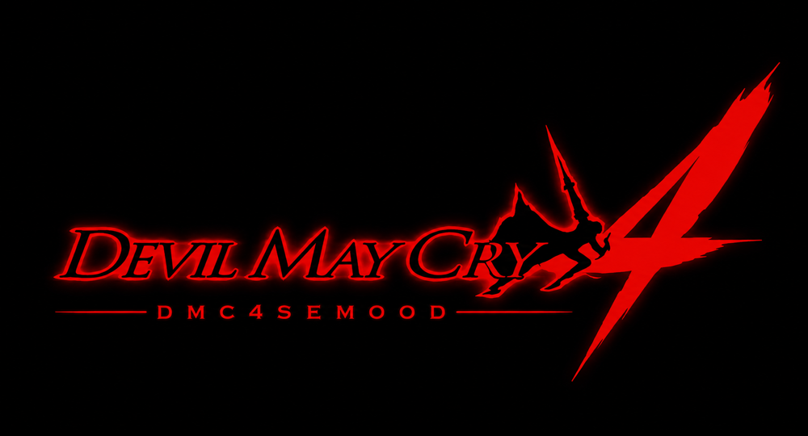

<div align="center">



<br>

[](https://github.com/adreamyvoice/DMC4SE-MOOD/releases/latest)
[](https://discord.gg/aethergrid)
[](LICENSE)

**An in-game mod menu for Devil May Cry 4: Special Edition**

</div>

---

An in-game mod menu for **Devil May Cry 4: Special Edition**, made by
**MistressDMC**. Press **`7`** (or **L3+R3**) in-game to toggle it.

**For the Windows PC version of Devil May Cry 4: Special Edition.** It's a
standard Windows `dinput8.dll` proxy that loads your system `dinput8.dll` at
runtime — one drag-in file.

Join the community: **discord.gg/aethergrid**

## Features

- **NEW in 1.4 — local 2-player co-op.** A second player takes over the
  doppelganger with their own controller or keyboard, playing the same
  character alongside you. See the **Co-op** tab.
- **372 cheats** across God Mode, Devil Trigger, Summoned Swords, Mobility,
  Cutscenes, Bloody Palace, and the full enemy **spawn-swap matrix**.
- Highlights: No One Takes Damage, No One Dies, **Enemy 1-Hit Kill**, **Must
  Style Mode**, **Player Can Not Be Hit**, infinite DT / air-hike / wall-jump /
  summoned swords, always sprint, auto-skip cutscenes, and "spawn X instead of Y"
  for every enemy.
- **Searchable** menu with collapsible categories, "Disable All", live on/off count.
- **Save / load configs** — store your whole setup (every cheat + toggle) to a
  named profile and reload it in one click, so you never re-pick everything. Tick
  **Auto-load on launch** to apply your default profile automatically each start.
- **Music player** — 28 tracks with a dropdown + `<` / `>` arrows, loop-one /
  playlist-loop / play-through modes, optional in-game background playback, and a
  working volume slider. Songs live in a `music\` folder beside the dll (see Install).

## What the menu does

Open the menu with **`7`** (or **L3+R3**). Everything is organised into tabs:

### System
Core toolbox: **save / load** named config profiles (with auto-load on launch),
**Teleport** to any Mission + Room and **Bloody Palace** quick-jump, free
**Camera** (distance / height) and window options, the **music player**, and
**Slow-Mo / Work Rate** + **Graphics** toggles (Depth of Field, Motion Blur,
God Rays). The core damage and style cheats live here too.

### General
The everyday gameplay tab: **Devil Trigger & Vergil** (Instant Trigger, Vergil
Perfect JDC / Judgment Cut), the **Combo Display** (live move-name readout with a
xN repeat counter), **No Limits** (no height cap, no jump-cancel / weapon-switch
limit, infinite air hikes), **Window & System** options, plus **Air Tricks**,
**Enemy Spawn**, **Character Switch** and **Costume** swapping, and the general
gameplay/health/item cheats.

### Character
Per-character toys. **Doppelganger** (spawn a fighting clone of who you're
playing, rebindable summon key), per-character live tweaks for **Dante** (Trickster
teleport, Gilgamesh charge), **Nero** (Air Calibur, Exceed Lv1–3), **Vergil**
(Trick Up, Beowulf charge), **Trish** (Lightning Kick), **Lady** (Infinite
Grenades), the **MistressDMC moveset** live toggles + combat tweaks, and
**Move Speed** per-move animation sliders. *Hold set values* pins them so they
don't reset.

### DEBUG
**HUD** show/hide — keep individual pieces (style meter, timer, DT, health, style
dial per character, lock-on marker) or hide all, keep weapons always showing, plus
a free-drag **Custom box** to keep any region. Also **Jump Cancel Window** size,
one-click **Unlock moves & weapons** (per character or everyone), **Gameplay
restores** (Restore Lucifer Bug, Fix Full House), **Boot / Opening Movie** skip,
and **Hotkeys**.

### Mods
There are **two** ways to mod, for different things — neither overwrites your game files:

- **MODS folder — characters, skins, costumes, movesets.** Drop a packaged `.arc` mod in
  its own folder under `MODS\` and pick it per character in the Mods tab. Skin/animation
  textures are packed *inside* the arc and read from memory, so a whole `.arc` is the only
  thing the game honors for them. (Use `tools/hud/inject.py` to bake loose textures into an
  `.arc`.)
- **HDD toggle — GUI / menus and standalone files.** **"Loose-file loading (HDD)"** in the
  Mods tab is an on/off switch for the GUI look: **OFF** = stock GUI, **ON** = your modified
  GUI. Put a modified arc under `MODS\HDD\` (mirroring the game's layout, e.g.
  `MODS\HDD\rom_pc\gui\mm01_eng.arc`) and the toggle swaps it in/out. HDD also lets genuinely
  loose standalone files in `nativeDX10\` load over the arc. It does **not** cover skins or
  animations — use the MODS folder for those.

See `MODS/README.md` for the full layout.

### Co-op

Local **2-player co-op** — the doppelganger becomes a real second player
instead of mirroring your inputs, so both of you play the same character
together.

- **Enable co-op** — off by default; with it off the doppelganger behaves
  exactly as it always has. Summon the doppelganger to start.
- **Player 1 / Player 2 device** — assign each player independently: game
  default, Controller 1–4, keyboard (WASD set), keyboard (Arrows/Numpad set),
  or either keyboard set plus mouse. Player 2 defaults to **Auto**: the first
  spare controller — never the one Player 1 is using — otherwise a keyboard
  set. So one controller gives you controller + keyboard automatically, and a
  second controller is picked up as soon as it is plugged in.
- **Co-op camera** — zooms out as the players separate so both stay in frame.
- **Auto-revive P2** — revives Player 2 about five seconds after going down.
- **Keep a keyboard player's keys off the other player** — stops shared
  keyboard keys from driving both characters.
- **Warp P2 to P1** — button, or the `HOME` key.

Player 2 keyboard layouts:

    WASD set : WASD move, Space jump, J/K/L attacks, LShift lock-on,
               Q = L2, E = R1, R = L1
    Arrow set: Arrows move, Num0 jump, Num1/2/3 attacks, RShift lock-on,
               Num4 = L2, Num5 = R1, Num6 = L1

Two people can share one keyboard using the two different sets, and two
physical keyboards work the same way (Windows reports them as a single
device, so the key sets are what separate the players).

### Language / Theme
English / Simplified Chinese, and a red ⇄ blue accent theme.

## How to use

### Open / close the menu
Press **`7`** on the keyboard, or click **L3 + R3** (both sticks) on a gamepad.

### Save / load your setup (System tab)
Type a name → **Save**, and your whole setup (every cheat + toggle) is written to
`DMC4SEMOOD_<name>.cfg` beside `dinput8.dll`. Pick a save from the dropdown and
**Load**. Tick **Auto-load on launch** to apply your default automatically.

### Per-character live tweaks (Character tab)
These edit live combat values from memory, so **play as the matching character**
and the controls light up (greyed out otherwise). **Right-click any slider** to
type an exact value, and tick **Hold set values** to keep them from resetting.

### Combo move names (General → Combo Display)
Move names show at the bottom of the screen as you fight, with a **xN** counter
when you repeat a move. Names ship pre-filled; to add or fix one, open **Edit move
names**, do the move in-game, type a name and **Set** (a **Paste** button is there
too). Names save to `MODS\movenames.cfg`.

## Build (Windows)

Needs **CMake** and **Visual Studio** (Desktop development with C++). The game is
32-bit, so the DLL is built for Win32.

```bat
build.bat
```

or manually:

```bat
cmake -B build -A Win32
cmake --build build --config Release
```

Output: `build\Release\dinput8.dll`.

> MinGW-w64 also works (`cmake -B build -G "MinGW Makefiles" && cmake --build build`).

## Install

> ### ⚠️ Required: downgrade to the 2015 launch build
> The cheat offsets target the **original 2015 launch build** of DMC4 Special
> Edition. You **must downgrade** your game to that build first, or cheats will
> mismatch and grey out. On Steam, open the console (`steam://open/console`) and
> grab the launch-build depot with `download_depot`, then point Steam's
> `Special Edition` folder at it. Follow a current DMC4SE downgrade guide for the
> exact depot/manifest IDs.

1. Open the game folder (`...\steamapps\common\Special Edition\`).
2. Download **`dmc4se-mood-1.1.zip`** from the
   [latest release](https://github.com/adreamyvoice/DMC4SE-MOOD/releases/latest)
   and extract its contents straight into the game folder. That drops in
   `dinput8.dll`, `dmc4semood_logo.rgba`, the menu theme in **`music\`**, and a
   **`MODS\`** folder (with the combo move-name list ready to go).
3. Launch the game and press **`7`** (or **L3+R3**) to open the menu.

   > Want your own background music? Drop any `.wav` files into the **`music\`**
   > folder (any sample rate / channels). They appear in the player's dropdown by
   > filename — hit **Rescan** in-menu. Convert with e.g.
   > `ffmpeg -i song.mp3 "music/My Song.wav"`.
   >
   > Adding skins / Bloody Palace mods? See **`MODS\README.md`** — drop each mod in
   > its own folder under `MODS\`, then **Reload** in the Mods tab.

> **No `dinput8_real.dll` needed.** The proxy loads your own system `dinput8.dll`
> at runtime, so it's a single drag-in with nothing to rename — and no
> "missing `dinput8_real.dll`" error on Windows.

## Credits

Made by **MistressDMC**.
